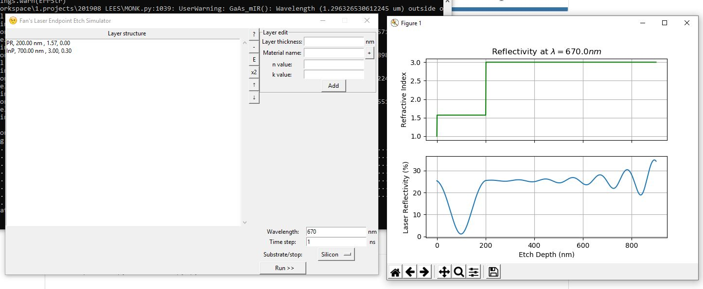
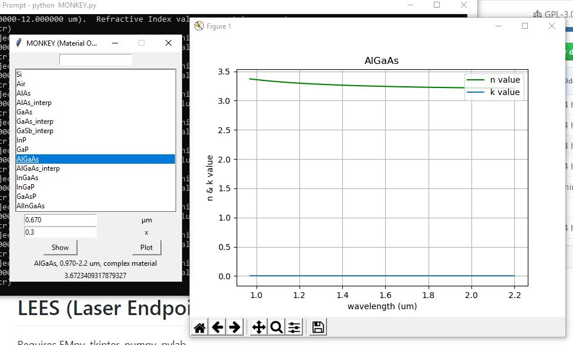

# LEES (Laser Endpoint Etch Simulator)

Requires EMpy, tkinter, numpy, pylab

A GUI based laser endpoint signal simulator using ElectromagneticPy module. 

# MONKEY (Material Optics N & K EquirY)

A simple program to plot n & k values of a material. Export the material definition file to Toho Specs and other spectroscopy tools. 

Used code from Demis D. John and Dustin Kleckner: nk database file.

